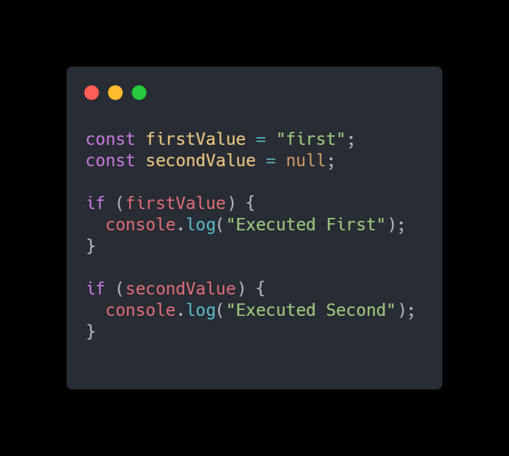
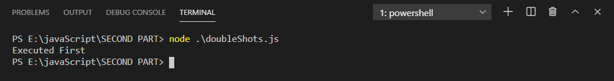
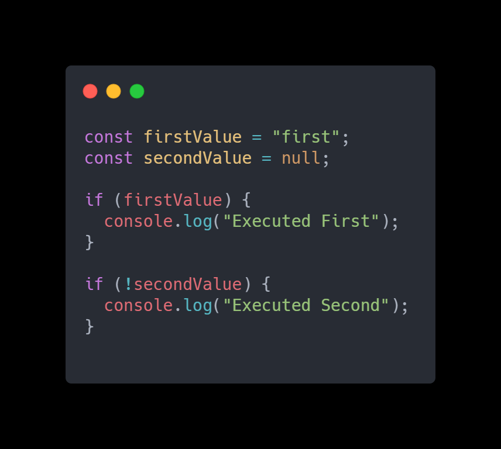
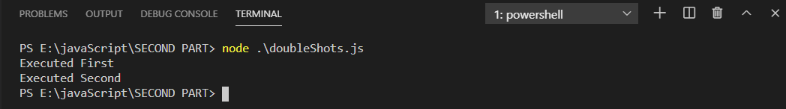

Let's start with an example :

Here we defined two variables as firstValue whose value is **"first"** which is a string and another variable secondValue whose value is **null**. If we execute the above code then which block will execute what do you think? Let’s see the output :

So what happened here as we know if condition statements deal with boolean values. In the first, if block it takes the firstValue and evaluates it as boolean. here it’s a string value which is truthy value in js, and therefore it considers that truthy value and the first block executes. While in the second case secondValue null which is a falsy value it considers that and therefore it is not executed.

> In JavaScript, a truthy value is a value that is considered true when encountered in a Boolean context.
> A falsy value is a value that is considered false when encountered in a Boolean context.

Here in the above example, it considered the truthy and falsy value instead of true and false which is not good in some cases And in such conditions, these **double shots (!!)** also called **double bang** helps us.

## Let’s see how it works

We just modify the second if block like below by adding (exclamation mark) **!** that is **not operator** in second if block condition.

And if we run code we get output like this (both if block conditions executed).

So what happened here after adding **!** is that secondValue variable which is a null which is treated as a **falsy** value is converted into boolean **true** value and because of that second if block is also executed.

> ! converts truthy and falsy value to the actual boolean context

But by adding this **!** we also reversed the associated value with that variable that is because of **!** **"not operator"** returned value is the opposite value of actual value (true as false and false as true).To fix this and get an actual true/false value we add another **!** so that it once again reverse this and we get the correct result. And that’s how we get second **!** operator.

Let's use this **!!** in second if block condition

**Result:**

We got the correct result. By using **!!** we got result in an efficient manner and it also reduces the chances of bugs in the complex use cases.

> Double shots (!!) first, change the value to the boolean opposite, and then take that returned boolean value and flip it, again, to the opposite.

### Be careful while using it first consider behavior of truthy and falsy values for given variable.
