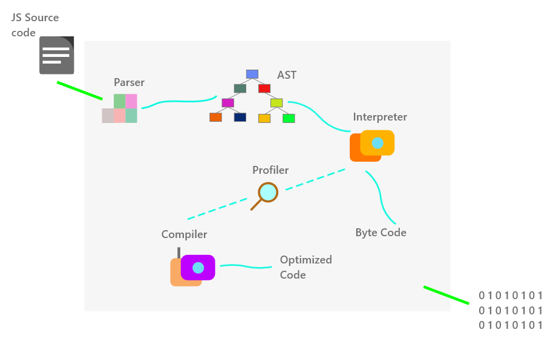

## Why the engine required?

Consider we have written a code in JS and that file given to a computer to perform a task. The computer will not able to perform a task as it can only understand **0** and **1** not a high-level language like JS. Then how the computer will understand that? Here comes the JS engine which takes the code and transforms it to understand by the computer.

> A JavaScript engine is a computer program that executes JavaScript (JS) code.

## Some JS engines examples:

1.V8 from Google is the most used JavaScript engine. Google Chrome and the many other Chromium-based browsers use it.

2.SpiderMonkey is developed by Mozilla for use in Firefox.

3.JavaScriptCore is Apple's engine for its Safari browser.

4.Chakra is the JavaScript engine of the Internet Explorer browser.

**To understand the working of the JS engine here we consider only the V8 engine as its most popular one.**

### V8 Engine

**Before going to the actual working of the JS engine first understand some terms in general:**

**Parser:** Parser reads the code from a source file line by line and checks for syntax errors if there is an error it throws an error otherwise it generates the tokens this tokes used to generate parse tree, abstract syntax tree.

**AST (abstract syntax tree):** The tokens generated by the parser form the AST. It is a tree-like representation of the syntactic structure of source code. Each node of the tree denotes a construct occurring in the source code.

**Interpreter:** An interpreter directly executes each line of code line by line, without requiring them to be compiled into a machine language program. As it starts executing line by line instead of analyzing the whole code it is fast but if we consider overall performance it is slow as compared to the compiler.
.

**Compiler:** It scans the whole code and then it starts the translation of code into machine code. At the start, it takes a long time to analyze the whole code but overall performance is fast as compared to an interpreter.

## Working of JS engine:

1. When a JS file is given to the engine it first parsed by the **parser** which gives tokens. Using these tokens the **AST** tree is generated.
2. And this code initially goes to an interpreter. In the V8 engine, they called it **Ignition**. This interpreter split out the byte Code. Remember byte code is not exactly machine code but is understandable by computers.
3. This is the one part but as we can see in the diagram there is a magnifying glass named as **profiler** also called Monitor.This profiler monitor code as its runs and makes notes to optimize the code.
4. Profiler monitors code and if it found the same line of code runs a few times it passes that some of the code to the compiler.
5. The compiler takes the code and tries to make optimizations in the code so that it can run faster. Then it replaces that repeated code with this optimized machine code given by the compiler. So that optimized code is used from that point instead of that slower byte code. This improves the speed of the compiler.
6. So interpreter allows running code immediately. and profiler and compiler help to optimize code. And from this, we get the **JIT Just-In-Time** compiler. The V8 compiler is also called **Turbofan**.

_By learning this internal working we can now write code that runs faster.
Also, remember the compiler is not perfect it can also make a mistake. it can try to optimize code but does the opposite. And if this happens it makes our program deoptimized.
Mostly in such cases engine reverts back changes if any performance degradation found.
but it always recommended writing efficient code that does not confuse the compiler._
