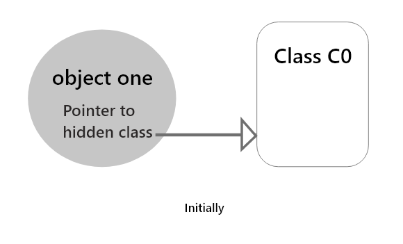
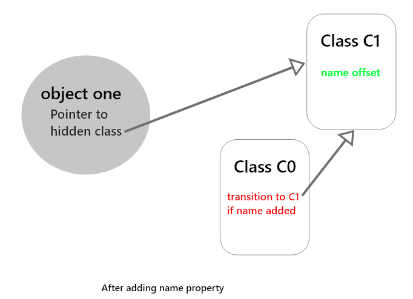
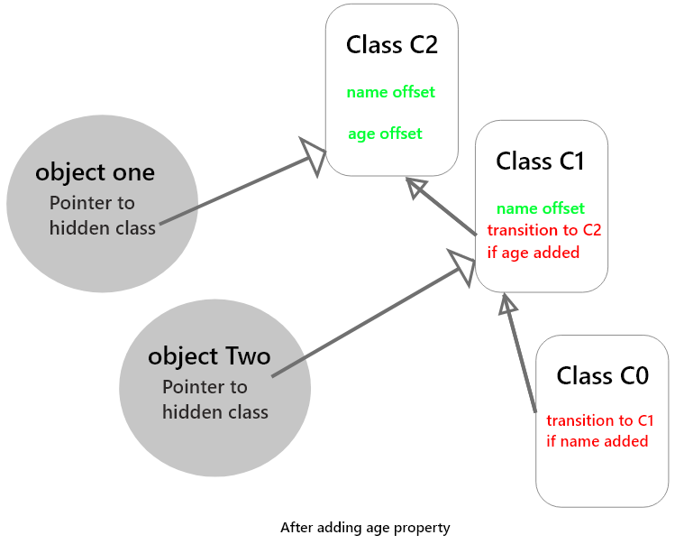

## Optimization techniques:

**1. Hidden Classes:**
During runtime, V8 creates hidden classes that get attached to each and every object. That allows optimizing the property access time.
_Consider an example:_

```
function Person(name) {
  this.name = name;
}

var one = new Person('One');
var two = new Person('Two');

```

When the Person function gets invoked to initialize the object **one** hidden class related to the object **one** gets created. Consider it as **C0**. initially, **C0** is an empty class after an invocation as it does not contain any properties. _(refer below diagram)_



But when **this.name = name** executed another class **C1** gets created containing memory offset of **name** variable. So initially object one pointing to **C0** but now it’s pointing to **C1**. and a condition called **transition** is gets added to **C0** stating if you add the property name in the object then the new hidden class is **C1**. _(refer below diagram)_



Now when another object **two** is initialized by invoking the Person function. It is going to use the same hidden class initially i.e. **C0**. but later the property name is added it will see **transition condition** in **C0** that if the **name** added refer to **C1**. So now object **two** also point to the hidden class **C1**.

_Currently both one and two objects using the same hidden classes. As both have the same properties._

Next if we add one more property to **one** object like below.

```
one.age = 25;
```

The new hidden class **C2** gets created and it contains offset for **name** and **age** property and **transition** condition gets added to **C1** that if **age** added go to class **C2**. _(refer below diagram)_



Till now it’s ok as each object pointing to the respective hidden class but we add properties randomly managing hidden classes become difficult and our code gets deoptimized.

**We can avoid this by adding properties in the same order for each object so that hidden classes can be shared and code can be optimized. Always assign all of an object’s properties in its constructor.**

**2. Inline Caching:**
Inline caching relies upon the observation where repeated calls made to the same function with the same type of object. In such cases, the V8 engine maintains a cache of objects that were passed to function as a parameter previously. Depending upon previous computation engine makes predictions about the type of objects going to pass to the function in the future. If the engine able to make a correct prediction the process of accessing object properties is avoided and directly previous stored information about objects hidden class are given. This will increase the speed of execution. To work Inline caching it is also important that objects of the same type that uses the same hidden classes. If that’s not the case engine will not able to access properties as different hidden classes assign different offsets to their properties.

```
function printName(user) {
  return `My name is ${user.firstName} ${user.lastName}`
}

const user = {
  firstName: 'Fname',
  lastName: 'Lname'
}

printName(user)

//Result: My name is Fname Lname
```

If we called **printName()** with same **user** object multiple time the result **My name is Fname Lname** get inline cached.
