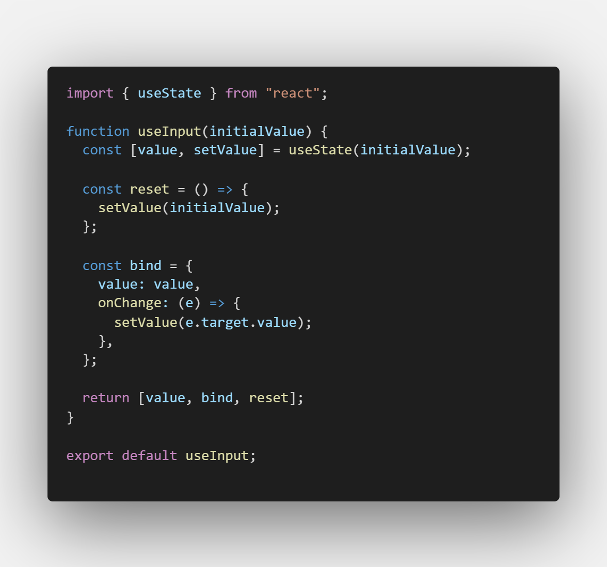
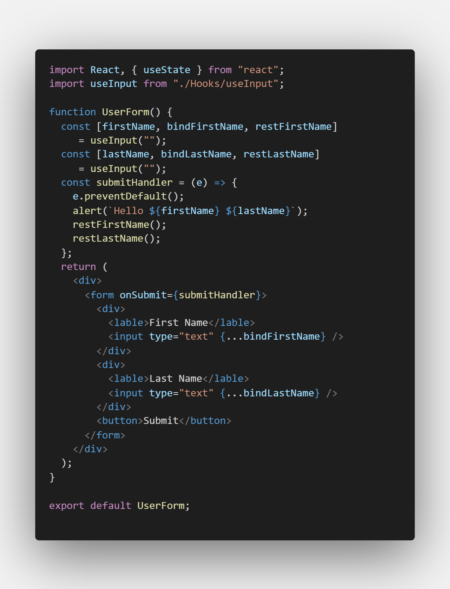

## What is use of custome hooks ?

A custom hook is basically a JS function which helps to **share logic between two or more components.** It's like a alternative to **render props** and **higher-order components** which we used share stateful logic between components.

For defining a custome hook we use JS function whose name start with **"use"**. Custom hook can also use other hook if required.

## How to implement?

For this example implement simple form to get user first and last name. 
### First we implement form in normal approach

1. Create a file **UserForm.js** and define a simple functional component.

2. import useState and create two variables

3. Add JSX for from

4. Now we change this input elements into controlled elements and add onSubmit handler to form.

5. Now implement submitHandler function

        const submitHandler = e =>{
            e.preventDefault()
            alert(`Hello ${firstName} ${lastName}`)
        }

4. Final code

5. Import this component into **App.js** and run with **npm start** 

### Now we implement hook

for that we have to encapsulate the input elements **bind value** and **onChange** attribute behaviour of input element.

1. Create a file **useInput.js** and add functional component and import **useState** hook
2. Create state variable to track the input field value and set default value to initialValue which will be pass as parameter.

3. Now we define function to reset values to initial values and also one object with two properties value and onChange. onChange is a function which gets event as parameter and set the value to target value.

4. finally we return value , defined object and reset function.

### next task is to use this in our form

5. Now in **UserForm.js** import **useInput.js** i.e. our useInput().
6. Next we replace useState hook call for firstName with useInput custom hook. here we pass inital value as empty as we pass before.
useInput() return three values that are value, bind object and reset function so we first  destructure them.

    const [firstName, bindFirstName, restFirstName] = useInput(' ')

##### NOTE : delete useState() for firstName

7. do same for last name.

    const [lastName, bindLastName, restLastName] = useInput('')

8. as from code we see **firstName** and **lastName** are used in submit handler , we have to use remaining two but where?

9. first we replace value and onChange attribute of firstName input element with bindFirstName like this 

        <input
           {...bindFirstName}
            type="text"
          />
    
10. do same for lastName.
11. last use resetFirstName() and restLastName() inside submit handler. 

> ***from above example we used custom hook concept to share the logic of assinging a value and*** 
>***onChange handler to each input element.***