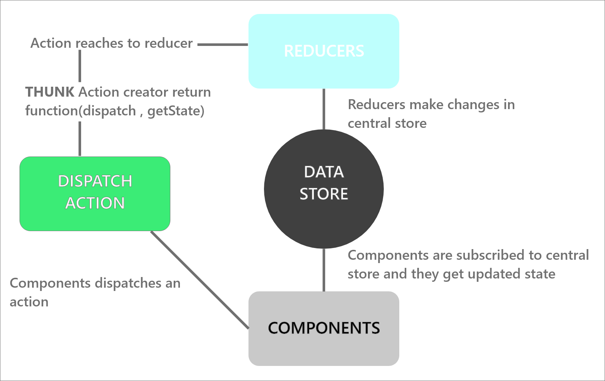

First we need to install **redux** and **react-redux** in our application. **react-redux** used to bind redux with our react application.

### Install

```
npm i redux react-redux

```

### create Reducer

First we create **Reducers** for our application. The reducer takes **state** and **action** as params.

> Reducer => ties the store and actions together

We are going to create two reducers as follows

```
<!-- authReducer.js -->
const initState = {};

const authReducer = (state = initState, action) => {
  return state;
};

export default authReducer;


```

In the above code we defined empty initial state **initState** and **authReducer** function which takes state and action as params.

```
<!-- projectReducer.js -->

const initState = {};

const projectReducer = (state = initState, action) => {
  return state;
};

export default projectReducer;

```

In the above code we defined empty initial state **initState** and **projectReducer** function which takes state and action as params.

Here we defined two reducers and need to pass them to our store for that first we need to combine them into single reducer using **combineReducers** function from **redux**.

```
<!-- rootReducer.js -->

import authReducer from "./authReducer";
import projectReducer from "./projectReducer";
import { combineReducers } from "redux";

const rootReducer = combineReducers({
  auth: authReducer,
  project: projectReducer,
});

export default rootReducer;
```

from above code snippets we can see that auth and project reducers combined together using
**combineReducers** function which takes an object as input. And we exported that combine reducer as **rootReducer**.

### create store

Now to use redux in our application we first need to create **store**. For that open
**index.js** file and import **createStore** from **redux** . And define const store using createStore().

```

<!-- index.js -->
import { createStore } from "redux";
import rootReducer from "./store/reducers/rootReducer";


const store = createStore(rootReducer)
```

Here we are passing **rootReducer** to createStore().
**_we can have multiple reducer for different functions. we are combining all them together and passing to rootReducer_**.

Next we need a way to use this to store in our application.

### providing the Store

We need to provide store to the **App** component so that our whole app has access to store. In **index.js** file we are importing **Provider** from **react-redux** and wrapping our **App** component within it. We are passing store as a prop to the Provider component.

```
<!-- index.js -->

import { Provider } from "react-redux";

<Provider store={store}>
    <App />
</Provider>
```

We are done with basic setup now we are going to use this in our app.

### connecting the Components useSelector()

Now we are going to use **useSelector()** hook to access data from our store.
To start we need some dummy data in our store for that go to **projectReducer.js** and add dummy data in **initState**.

```
<!-- projectReducer.js -->
// some dummy data to our state for testing
const initState = {
  projects: [
    { id: 1, name: "Project One" },
    { id: 2, name: "Project Two" },
    { id: 3, name: "Project Three" },
  ],
};
```

Next in **Home** component we are going to display this data.

We are going to use **useSelector** hook from **react-redux**. This hook allows you to extract data from the Redux store state, using a selector function.

```
<!-- Home.js -->

import React from "react";
import { useSelector } from "react-redux";

export default function Home() {

  // getting projects list from store
  const projects = useSelector((state) => state.projects);

  return (
      <div className="home">
        {projects.projects.map((project) => (
          <p key={project.id}>{project.name}</p>
        ))}
      </div>
  );
}


```

In above code we are using selector hook and getting projects list from store and rendering using map function.

### performing actions useDispatch()

**useDispatch()** hook returns a reference to the dispatch function from the Redux store. You may use it to dispatch actions as needed.

Let's begin with defining action creator. (action describes what opration to do)

Create a file for actions called **projectActions.js**.
Actions are plain JavaScript objects. Actions must have a type property that indicates the type of action being performed.

```
<!-- projectActions.js -->

export const addProject = (project) => ({
  type: ADD_PROJECT,
  payload: project,
});

```

Here we defined an action creator called addProject which has action of type property called **ADD_PROJECT** and also has payload **project**.

Then we make changes in our project reducer to perform operation.

```
<!-- projectReducer.js -->

const projectReducer = (state = initState, action) => {
  switch (action.type) {
    case "ADD_PROJECT":
      return {
        ...state,
        projects: [...state.projects, action.project],
      };

    default:
      return state;
  }
};

```

In the above code we added switch case which takes action.type as value and execute case, according to that type. We defined case ADD_PROJECT which returns existing state and only add payload project to existing projects list. And we also have default state which returns state as it is.

Now we are going to use this useDispatch() hook to add project in our projects state.

```
<!-- Home.js -->
import React from "react";
import { useSelector, useDispatch } from "react-redux";


export default function Home() {
  const projects = useSelector((state) => state.projects);

  const dispatch = useDispatch();
  return (

      <div className="home">
        {projects.projects.map((project) => (
          <p key={project.id}>{project.name}</p>
        ))}

        <button
          onClick={() =>
            dispatch({
              type: "ADD_PROJECT",
              project: { id: 4, name: "Project Four" },
            })
          }
        >
          Add Project
        </button>
      </div>

  );
}
```

In the above code we are importing **useDispatch** from **react-redux** and we are defining const dispatch using useDispatch() and using that dispatch to dispatch an action. On button click we are dispatching an action of type ADD_PROJECT and also passing project object as payload. after clicking on that button the passed project payload is going to add in our projects state.

### Async Code with Redux

**_By default actions in Redux are dispatched synchronously, which is a problem for some apps that needs to communicate with an external API or perform side effects._**

As we know basic working of redux that component dispatch an action. This action may contain additional data called as payload which passed by components. This action then passed to reducer. There can be multiple reducers or can be just one so when this action reaches to reducer it has the power to make changes in central data store. When changes happen in data store, they trigger a subscription and this subscription passes updated state as props to components. **But we don't know how to perform some async task during this whole process and where?** We cannot do async task in component and also we can not do it in reducer then only part left is between dispatching an action and reducer receiving an action. And to do this task in between we need middleware which is **Thunk**.

**_Redux allows for middleware that sits between an action being dispatched and the action reaching the reducers._**
**_Redux Thunk is a middleware that lets you call action creators that return a function instead of an action object._**

In simple words Thunk middleware halts the dispatch perform async request and then resumes dispatch.

> Middleware we used for this is Redux Thunk.


In above diagram we can see this working.

Let's see Thunk in action.

#### Install

```
npm i redux-thunk
```

#### implement Thunk

Open **index.js** and import thunk from redux-thunk. We need to use this middleware in our store but, **how we can do that?**

For that we need to use **applyMiddleware**. **_applyMiddleware() creates a store enhancer that applies middleware to the dispatch method of the Redux store._**

```
<!-- index.js -->

import React from "react";
import ReactDOM from "react-dom";
import "./index.css";
import App from "./App";
import * as serviceWorker from "./serviceWorker";
import { createStore, applyMiddleware } from "redux";
import rootReducer from "./store/reducers/rootReducer";
import { Provider } from "react-redux";
import thunk from "redux-thunk";

//  using applyMiddleware for thunk
const store = createStore(rootReducer, applyMiddleware(thunk));

ReactDOM.render(
  <React.StrictMode>
    <Provider store={store}>
      <App />
    </Provider>
  </React.StrictMode>,
  document.getElementById("root")
);

// If you want your app to work offline and load faster, you can change
// unregister() to register() below. Note this comes with some pitfalls.
// Learn more about service workers: https://bit.ly/CRA-PWA
serviceWorker.unregister();
```

from above code we can see we are passing **applyMiddleware()** to **createStore()** and passing thunk to **applyMiddleware**.

Next we make changes in our project actions which we created before.

```
<!-- projectActions.js  -->

export const addProject = (project) => {
  return (dispatch, getState) => {

    //make async call to database (e.g. firebase) / network api call
    console.log("ASYNC CALL RUNNING");

    setTimeout(() => {
      //setTimeout used only to simulate async task

      dispatch({ type: "ADD_PROJECT", project });
      console.log("ASYNC CALL DONE");
    }, 3000);

  };
};
```

From above code we can see that in the previous step we return an object, but here we are returning function using thunk. The function here takes **dispatch**, **getState** as params. dispatch here is actually dispatches an action to reducer. so basically first we performing our async task and then dispatching action.

To make all this work we need to make changes in the **Home.js** . In Home.js we are importing **addProject** function from projectActions and using like a normal function with button onClick.

```
<!-- Home.js -->
import React from "react";
import { useSelector,useDispatch } from "react-redux";
import { addProject } from "../../store/actions/projectActions";

export default function Home() {
  const projects = useSelector((state) => state.projects);

  const dispatch = useDispatch();
  return (

      <div className="home">
        {projects.projects.map((project) => (
          <p key={project.id}>{project.name}</p>
        ))}

        <button
          onClick={() => dispatch(addProject({ id: 4, name: "Project Four" }))}
        >
          Add Project
        </button>
      </div>

  );
}

```

> In this section we explored react-redux, thunk in action with small examples.
