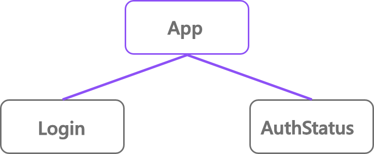
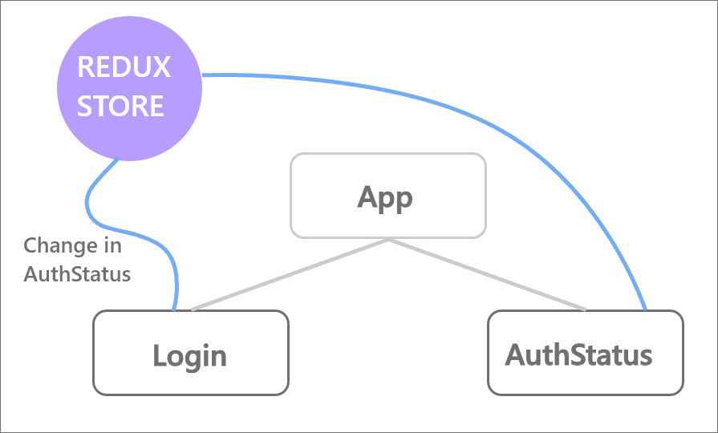
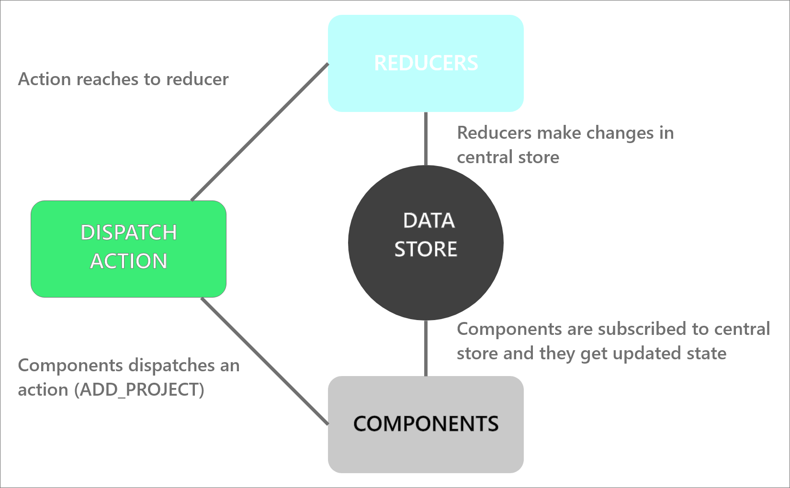

In this section first we explore react-redux theoretically and in second section we explore code examples.

### What is Redux ?

Redux is a popular JavaScript library for managing the state of your application.State of an application is the state respresented by the individual component of that app.

e.g state of registration form

```
state = {
fullname : "",
username : "",
email : "",
password : "",
}
```

Redux will store and manage the state of an application.

### Why we need redux in react?

Consider a react app consist 3 components **App, Login, AuthStatus**. Now when Login operation happens, it changes the status of user and it's shown in **AuthStatus** component. To show that user status in that component the result of login i.e user logged in or not is need to pass to the **AuthStatus** component which is sibling of **Login** component. To do this, first we uplift the state upto the parent component **App** then we pass it to **AuthStatus** component. In below figure this opration is highlighted...



This is a small app example, but Now imagine what happens when a state has to be shared between components that are far apart in the component tree. The state has to be passed from one component to another until it gets to where it is needed. In such cases sharing data among sibling components becomes difficult in a large application. And also we are passing data through components which actually not using that data. This makes the state difficult to maintain and that's why we need **REDUX** for state management.



With Redux your state is stored outside of component. if **Login** component want to update state it communicate with store and update the state and if **AuthStatus** component want to access state it can access from the store.

### How Redux works?

let's first understand **3 core concepts**

#### Store

A store holds the state of your application. There is only one store in entire application. We can access, update state of that store with provided functions.

> **_The state of your whole application is stored in an object tree within a single store._**

#### Actions

The actions describes the changes in the state of the application.

> **_The only way to change the state is to emit an action, an object describing what happned ._**

This prevent the direct oprations on the state.

#### Reducers

The reducer is actually carries out the state transition depending upon the action.

> **_To specify how the state tree is transformed by actions,you write pure reducers ._**

Reducers are functions which take the previous state and an anction and return new state.

---

### shop example

Consider a stationery shop as an example. The shop is our state **(redux store)** which contains all the products. We go to store and ask shopkeeper to show pen we never directly take the pen from store shelve **(redux Action)**. Then shopkeeper takes the pen and give us.
here shopkeeper is **reducer**.

| Shop Example           | Redux   | Use                                 |     |     |
| ---------------------- | ------- | ----------------------------------- | --- | --- |
| Shop                   | Store   | Holds the state of your application |     |     |
| Want to purchase a pen | Action  | Describes what happened             |     |     |
| Person working in shop | Reducer | Ties the store and actions together |     |     |

---

**now let's see how all this works together...**



From above image we have component here, which dispatch an action (e.g. ADD_POST). This action may contain additional data called as payload which passed by components. This action then passed to reducer. There can be multiple reducers or can be just one so when this action reaches to reducer it has the power to make changes in central data store. When changes happen in data store, they trigger a subscription and this subscription passes updated state as props to components.

> so far we explored what is redux and how it's useful in our app.
