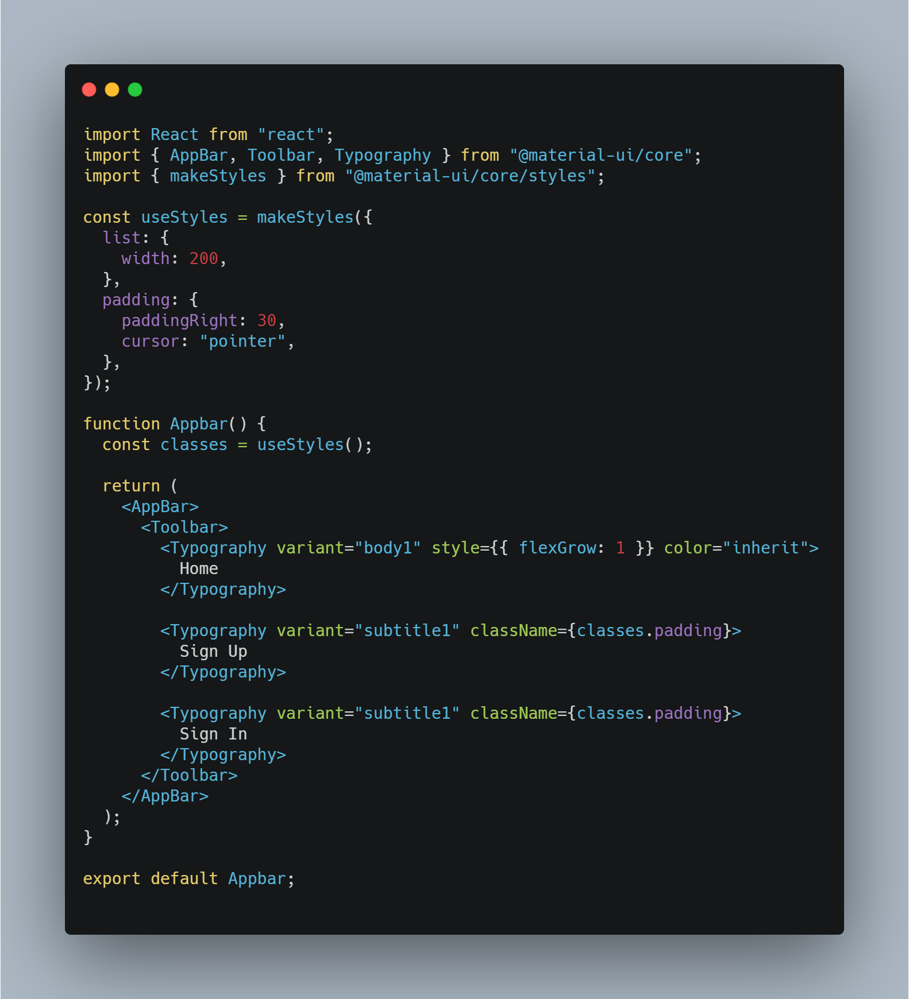
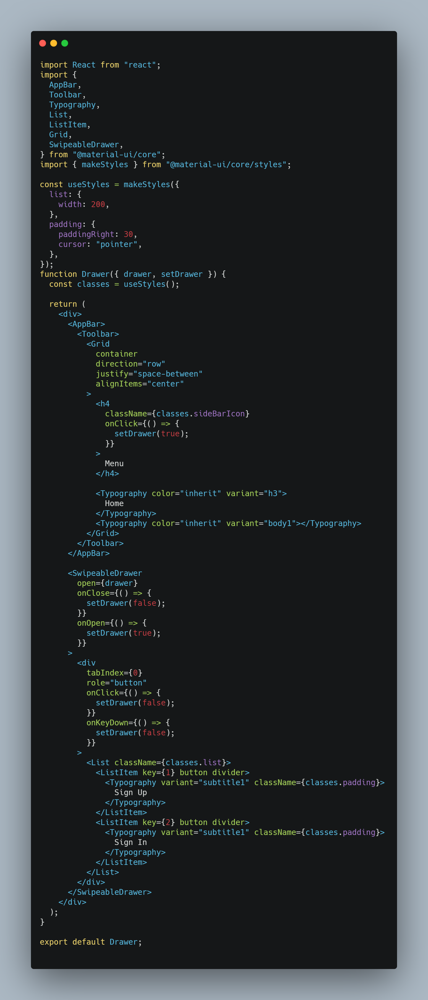
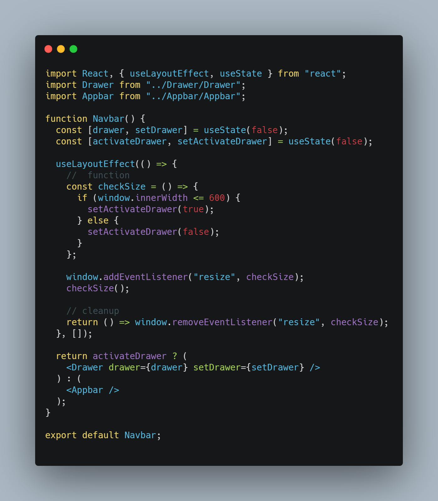
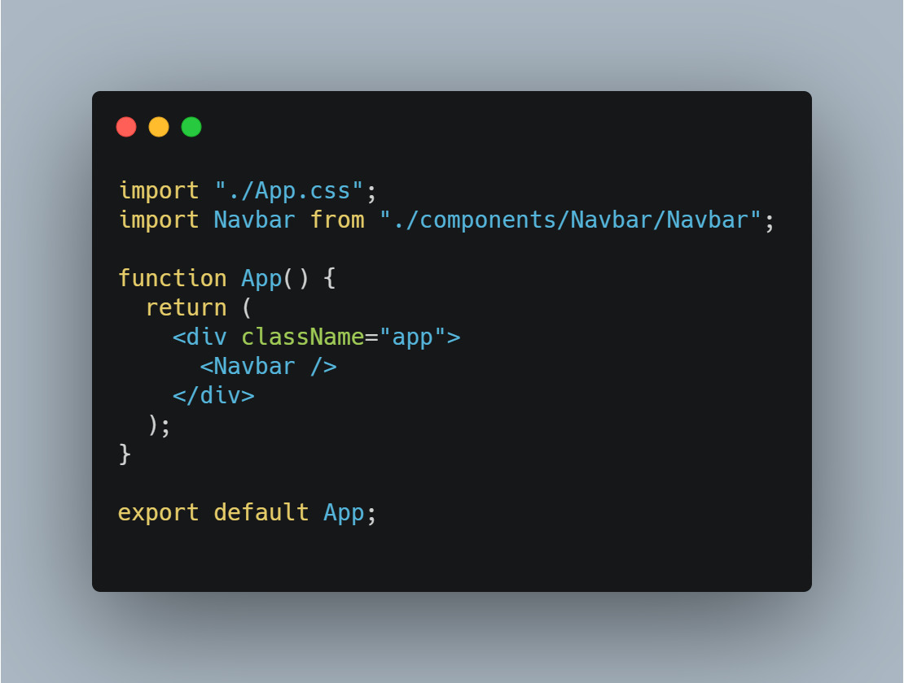
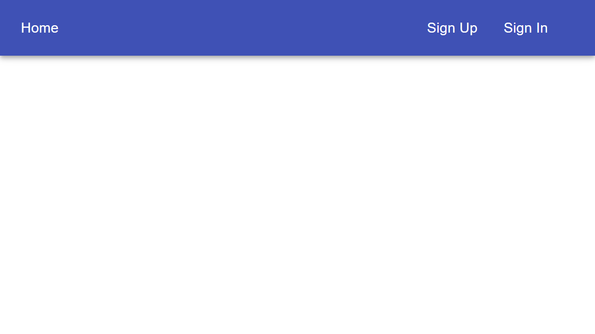
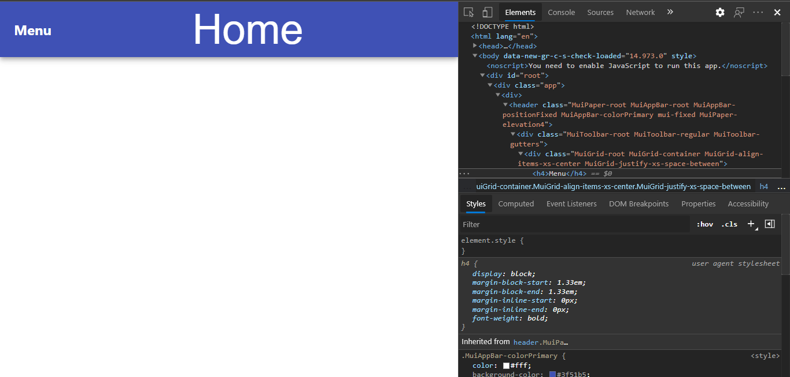
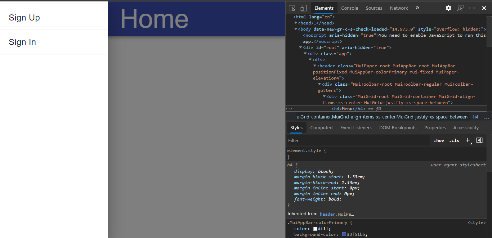

A few days back I was working on one project with the Material UI library. In the middle of the project when I was implementing the Navigation bar I found out it’s not responsive. Material UI provides the AppBar component and it’s not responsive and I wanted a sidebar on small screens. Coming from Bootstrap I am not able to find any classes like bootstrap in Material UI to make it responsive. So I thought to go for CSS to make it responsive but I am not able to do that. Then while searching for solutions I found useLayoutEffect Hook. So in this blog, we will implement Navbar using Material UI with useLayoutEffect.

Before going into code let's first see what is useLayoutEffect?

# What is useLayoutEffect Hook?

useLayoutEffect is quite the same as **useEffect** hook. It also takes a **function** to perform side effects and also has an **array of dependencies**. But the difference is the **time of invocation**.

**In case of useEffect:**
The function passed to useEffect will run asynchronously after the render is committed to the screen. That is changes are painted on the screen then useEffect invoked.

**In case of useLayoutEffect:**
It has the same signature as useEffect, and only differs in when it is fired. It fires synchronously after all DOM mutations. That is useLayoutEffect invoked before the screen is painted.

Now let's move to code.

### First create react app and install Material UI

```
//create react app
npx create-react-app uselayouteffect-demo

//Install material ui
npm install @material-ui/core

```

### Implementation

Now let's first define two components Drawer and Appbar. **Drawer** component returns a Material UI sidebar which we render for smaller screens and **Appbar** component returns a Material UI AppBar which we render for the larger screen.

**Appbar.js**


**Drawer.js**


Now we render these components based on our screen size using useLayoutEffect.
Create **Navbar.js** and import both components and also import **useLayoutEffect**, **useState** from React.

```
<!-- Navbar.js -->

import React, { useLayoutEffect, useState } from "react";
import Drawer from "../Drawer/Drawer";
import Appbar from "../Appbar/Appbar";

function Navbar() {
  return (
    <div>

    </div>
  )
}

export default Navbar
```

Now we define two boolean state variables. First to open drawer from side after clicking on Menu icon. And second to decide when to show Drawer and when Appbar.

```
// to toggle sidebar
const [drawer, setDrawer] = useState(false);

//based on this we are going to show  Drawer
const [activateDrawer, setActivateDrawer] = useState(false);
```

Next we need a function which will get the width of our screen and set this **activateDrawer** variable true or false based on our condition (if true show Drawer otherwise Appbar).

```
const checkSize = () => {
    if (window.innerWidth <= 600) {
        setActivateDrawer(true);
    } else {
        setActivateDrawer(false);
    }
};

```

Here we setting activateDrawer to true if width is less than or equal to 600 that is when screen width is less than or equal to 600 we are going to replace Appbar with Drawer.
Next we will add resize event listener of browser window passing this above function.

```
window.addEventListener("resize", checkSize);
```

and call the function **checkSize()**.
final logic inside useLayoutEffect hook like this

```
useLayoutEffect(() => {
    //  function
    const checkSize = () => {
      if (window.innerWidth <= 600) {
        setActivateDrawer(true);
      } else {
        setActivateDrawer(false);
      }
    };

    window.addEventListener("resize", checkSize);
    checkSize();

    // cleanup
    return () => window.removeEventListener("resize", checkSize);
}, []);
```

And we also defined a cleanup function so that Whenever our component is unmounted the event listener won’t be left attached.

In the component where we return JSX we conditionally return Appbar or Drawer component based on activateDrawer. And don’t forget to pass drawer and setDrawer props to Drawer component so that drawer can open and close.

```
return activateDrawer ? (
    <Drawer drawer={drawer} setDrawer={setDrawer} />
  ) : (
    <Appbar />
  );
```

**Navebar.js**


And last use this Navbar component where you require in this case I am going to add in **App.js**.


## Result

**Large Screen**



**Small Screen**



**Drawer Open**



> **_And finally we learn about useLayoutEffect hook in react._**
